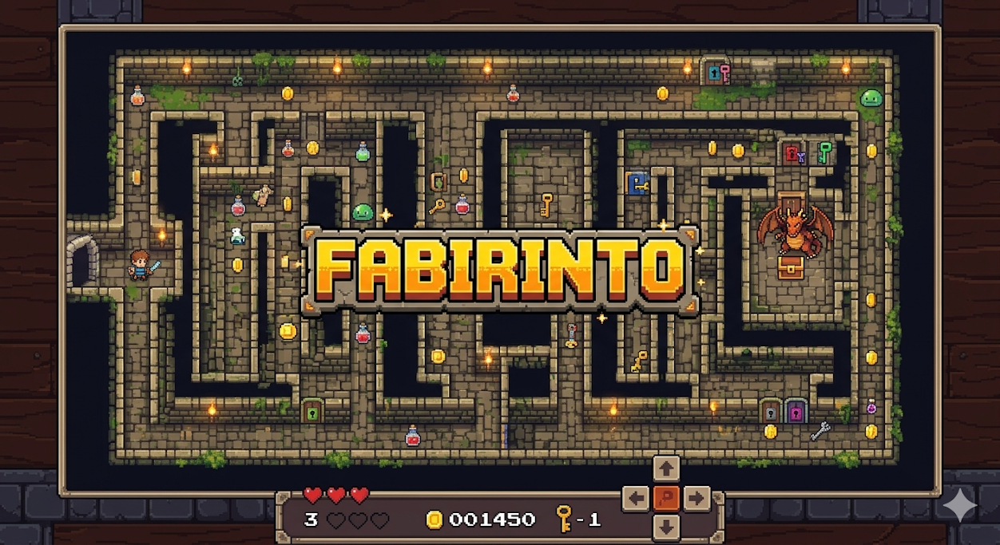

== Laberinto (FABIRINTO 2.0)

  

== Materia
* *Lenguaje de Programacion - Laberinto*

== 👥 Autores
* *Allan González*
* *Andrés Reyes*
* *Fernando Reyes*
* *Mitchael Ruíz*

== 📁 Contenido del Proyecto
* **`app/main.py`**: Código fuente principal del juego desarrollado en Python.
* **`app/base-datos/puntuaciones.json`**: Base de datos local en formato JSON que almacena el ranking de puntuaciones (se genera automáticamente al ejecutar).
* **`doc/index.adoc`**: Informe técnico principal con los requerimientos, diagramas y análisis del proyecto.
* **`doc/recursos/`**: Carpeta que contiene los diagramas de flujo, diagramas de clase (PlantUML) y el banner del juego.
* **`doc/build/html/`**: El informe final exportado a formato HTML para su visualización en navegadores.
* **`app/requirements.txt`**: Archivo con las dependencias necesarias para ejecutar el juego en Linux Debian.

